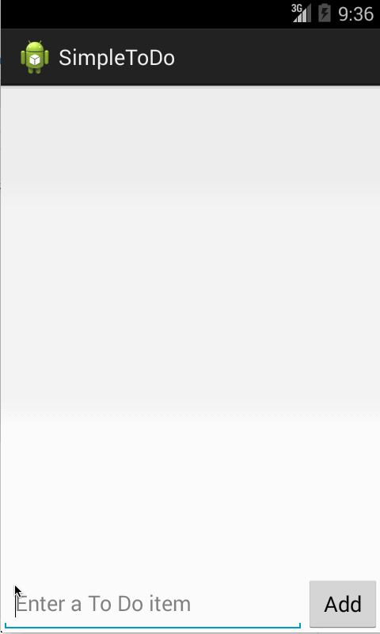

SimpleToDo
====
This is an Android Application for the To Do List.

Time Spent (Coding): 6+ hours (not bad for limited experience with PhoneGap and having never taken a Java or Android class before)

Time Spent (Setup): 30 mins (had setup MUCH older Eclipse/ADK on another machine so it was familiar)

Completed User Stories:

* [X] First Version of the App, [ToDoActivity] a list of ToDo Items Saved to file that can have items added to it (text field and Add button) or removed from it (long click)
* [ ] Edit feature added to the First Version, a click of an item in To Do list leads to the next activity [EditItemActivity] where you can edit that item and then Save and return to the [ToDoActivity] where your changes will be reflected and saved to file.

Styling Modifications:

* [X] Add capability to press Enter instead of clicking **Add** button
* [X] Ignore attempts to Add null entries and beep
* [ ] Changed the app logo to an elephant
* [ ] Changed the app to be centered around the idea that an elephant never forgets
* [ ] Modified the text field and button width at the top of the Edit Activity and added the elephant image again
* [ ] Remove the unused dropdown menu from the Activity Bar in the app.

Basic Priorities (without styling):

* [ ] Added a custom ArrayAdapter to support priority information
* [ ] Added a custom class (`ToDoItem`) to help with representing the data in the to do list
* [ ] Added Checkbox to Edit View to allow users to change the priority of a to do item.

Walkthrough of user stories:

GIFs created by LiceCap <http://www.cockos.com/licecap/>
